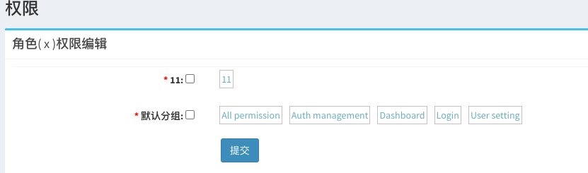

laravel-admin 基础类封装
======

## 安装
```shell
composer require putyy/laravel-admin-base
```

## 使用

### Controller

> LaravelAdminBaseController 继承即可使用

### Actions

> DeleteAction、LockAction 结合自身项目自定义action继承 实现对应的操作
>
> 如下：
>

```php
<?php
declare(strict_types=1);

namespace App\Admin\Actions;

class DeleteAction extends \Pt\AdminBase\Actions\DeleteAction
{
    /**
     * 假删除 需要设置的值
     * @return array
     */
    public function deleted(): array
    {
        return ['is_del' => 2];
    }
}
```

> 然后控制器调用

```php
<?php
declare(strict_types=1);

namespace App\Admin\Controllers;

class TestController extends \Pt\AdminBase\Http\Controllers\LaravelAdminBaseController
{
    // ...
    protected function grid()
    {
        // ...
        $grid->actions(function ($actions) {
            $actions->add(new \App\Admin\Actions\DeleteAction(false));
        });
        // ...
    }
    // ...
}
```

### 权限展示重写



> 1. admin_permissions表添加slug_group字段
     >
     >   ALTER TABLE `admin_permissions`
     > ADD COLUMN `slug_group` varchar(100) NOT NULL AFTER `slug`;
>
> 2. 添加路由
>

```php
<?php
Route::group([
    'prefix'        => config('admin.route.prefix'),
    'middleware'    => config('admin.route.middleware'),
    'as'            => config('admin.route.prefix') . '.',
], function (Router $router) {
    $router->prefix('auth-rewrite')->group(function (Router $router) {
        $router->resource('role', \Pt\AdminBase\Http\Controllers\RoleController::class);
        $router->get('role-permissions-detail/{id}', '\Pt\AdminBase\Http\Controllers\RoleController@detailPermission');
        $router->post('role-permissions-save', '\Pt\AdminBase\Http\Controllers\RoleController@savePermission');
        $router->resource('permissions', \Pt\AdminBase\Http\Controllers\PermissionsController::class);
    });
});
```

